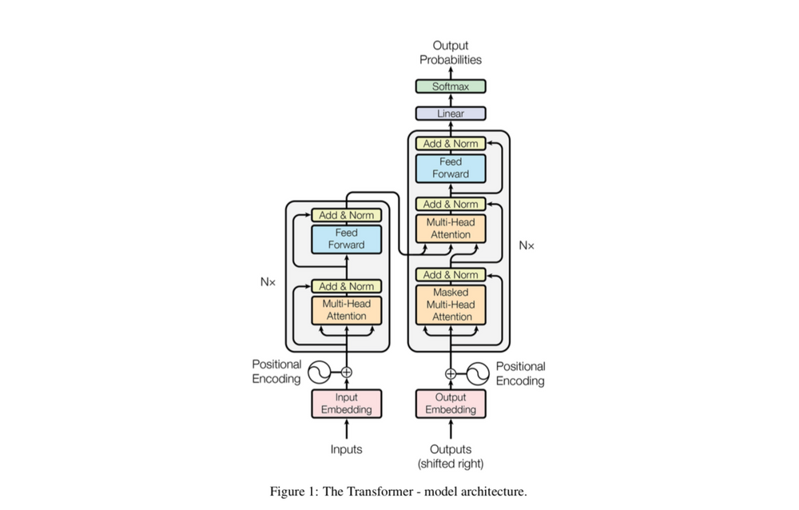
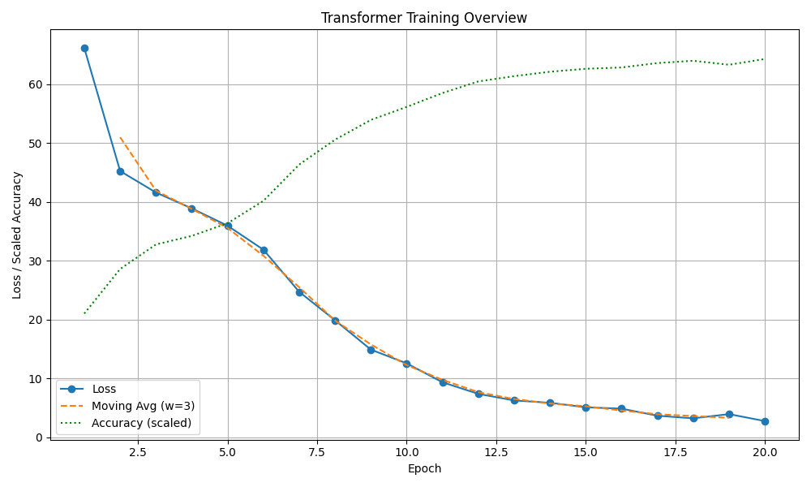

# 🧠 Transformer from Scratch - Attention Is All You Need Paper Implementation

In this repo, I have coded a PyTorch implementation of the Transformer architecture proposed in the [Attention Is All You Need](https://arxiv.org/abs/1706.03762) paper by Vaswani et al., **entirely from scratch** — no `nn.Transformer` used, and have trained it and performed inference. I have manually written the logic of all the **core components** like Multi-Head Attention, Positional Encoding, Residual Connections, and have built the full encoder-decoder architecture, introduced in the paper.

---

## 📌 Table of Contents

- [📝 Architecture](#-architecture)
- [📖 Background](#-background)
- [🛠 Features](#-features)
- [📂 Project Structure](#-project-structure)
- [🚀 How to Run](#-how-to-run)
- [📈 Training Phase](#-training-phase)
- [📉 Understanding the Loss](#-understanding-the-loss)
- [📊 Results](#-results)
- [📉 Training Curve](#-training-curve)
- [📚 References](#-references)

---

## 📝 Architecture



---

## 📖 Background

> “Attention is all you need” introduced a novel, fully attention-based architecture that eliminated recurrence entirely in sequence transduction tasks.

This project recreates that model step by step using only **PyTorch base modules**.

Key ideas:
- Multi-Head Scaled Dot-Product Attention
- Positional Encoding (sinusoidal)
- Layer Normalization & Residual Connections
- Encoder-Decoder Structure

---

## 🛠 Features

✅ Pure PyTorch implementation (no high-level `nn.Transformer`)  
✅ Modular, extensible architecture  
✅ Toy `CopyDataset` for sanity checking  
✅ Supports batch training, masking, and auto-regressive decoding  
✅ Well-structured for later expansion to translation, summarization, etc.

---

## 📂 Project Structure

```bash
transformer_project/
│ 
├── data/
│   └── dataset.py              # Copy task dataset
├── model/
│   ├── transformer.py          # Transformer architecture
│   └── transformer_modules.py  # MHA, FFN, PosEnc, etc.
├── train/
│   └── train_loop.py           # Training logic (if separated)
├── utils/
│   ├── config.py               # Hyperparameters
│   └── masks.py                # Attention masks
├── scripts/
│   ├── train.py                # Run training
│   ├── evaluate.py             # Evaluate predictions
│   └── plot_training_metrics.py # Plot loss/accuracy
├── assets/                     # Training curves and metrics
└── README.md
```

---

## 🚀 How to Run

### ✅ 0. Create folders called `checkpoints/` and `assets/` in the root directory. This is where weights and metrics will be saved.

### ✅ 1. Set up environment

```bash
conda create -n attention-fixed python=3.9
conda activate attention-fixed
pip install torch numpy pandas matplotlib
```

### ✅ 2. Train the model

```bash
python scripts/train.py
```

### ✅ 3. Evaluate on custom inputs

```bash
python scripts/evaluate.py
```

### ✅ 4. Plot training metrics (loss + accuracy)

```bash
python scripts/plot_training_metrics.py
```

---

## 📈 Training Phase

The model is trained on a simple **CopyDataset** — a synthetic task where the target is to exactly match the input sequence. This is a standard sanity check for sequence-to-sequence models.

The loss and accuracy over 20 epochs is shown below:

```
Epoch 1: Loss = 66.1093, Accuracy = 0.3182
Epoch 2: Loss = 45.2329, Accuracy = 0.4327
Epoch 3: Loss = 41.5911, Accuracy = 0.4957
Epoch 4: Loss = 38.8925, Accuracy = 0.5177
Epoch 5: Loss = 35.9496, Accuracy = 0.5502
Epoch 6: Loss = 31.8827, Accuracy = 0.6077
Epoch 7: Loss = 24.7230, Accuracy = 0.7010
Epoch 8: Loss = 19.8984, Accuracy = 0.7648
Epoch 9: Loss = 14.9138, Accuracy = 0.8155
Epoch 10: Loss = 12.5792, Accuracy = 0.8490
Epoch 11: Loss = 9.3674, Accuracy = 0.8847
Epoch 12: Loss = 7.3986, Accuracy = 0.9145
Epoch 13: Loss = 6.2786, Accuracy = 0.9280
Epoch 14: Loss = 5.8881, Accuracy = 0.9393
Epoch 15: Loss = 5.1133, Accuracy = 0.9470
Epoch 16: Loss = 4.8875, Accuracy = 0.9503
Epoch 17: Loss = 3.6853, Accuracy = 0.9617
Epoch 18: Loss = 3.2409, Accuracy = 0.9675
Epoch 19: Loss = 3.9596, Accuracy = 0.9573
Epoch 20: Loss = 2.7794, Accuracy = 0.9720
```

This decreasing trend in loss and increasing trend in accuracy confirm that the model is learning to copy the input sequence.

---

## 📉 Understanding the Loss

I have used `nn.CrossEntropyLoss`, which is standard for classification tasks. In the context of language modeling and sequence prediction:

- The model outputs a tensor of shape `(batch_size, len_of_sequence, vocab_size)` — representing logits over vocabulary.
- The true targets are token indices of shape `(batch_size, len_of_sequence)`.
- The loss is computed **per token**, and then averaged.

In theory, if your vocabulary has 10 tokens, the worst-case (uniform guessing) per-token loss is:

```text
CE_loss = -log(1 / 10) ≈ 2.302
```

So a perfect model copying a 7-token sequence would ideally get:

```text
2.302 × 7 = ~16.1 total loss per sample
```

With enough epochs, the Transformer converges well below this. A decreasing loss confirms the model is learning meaningful mappings from source to target tokens.

---

## 📊 Results

**Evaluation Input → Output:**

```python
Input sequence:      [1, 2, 3, 4, 5, 6, 7]
Generated sequence:  [1, 2, 3, 4, 5, 6, 7]
```

✅ This proves the model has learned the copy task.

---

## 📉 Training Curve

Below is the combined training curve showing both the raw loss, smoothed loss (moving average), and scaled accuracy:



---

## 📚 References

- [Attention is All You Need (Vaswani et al., 2017)](https://arxiv.org/abs/1706.03762)
